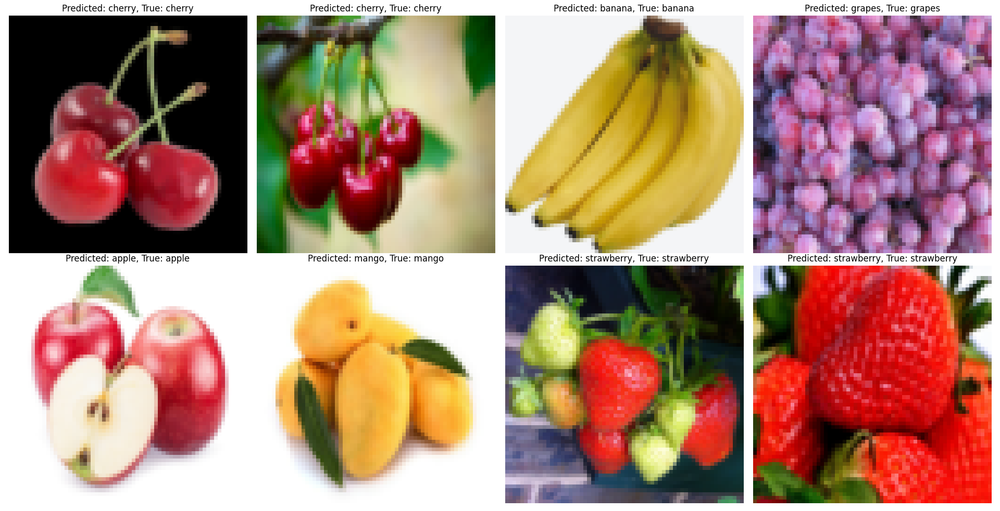

# Image Classification with PyTorch

This project demonstrates image classification using a Convolutional Neural Network (CNN) implemented with PyTorch. The CNN is trained to classify images of fruits into different classes. It utilizes the torchvision library to preprocess the data and create a dataset for training.

## Project Overview

The project includes the following components:

- Data preprocessing and loading using `torchvision.datasets.ImageFolder`.
- Definition of a CNN model with PyTorch's `nn.Module`.
- Training the model using a custom training loop.
- Visualization of predicted class labels on test images.

## Example Output

Below is an example output showing predicted class labels for test images:

## Getting Started

To run the project:

1. Install the required libraries listed in `requirements.txt`.
2. Organize your dataset in the `fruits` directory.
3. Run the Python script `train_model.py` to train the CNN model.
4. Use the trained model to predict class labels using `predict_label.py`.

## Dependencies

- Python 3.x
- PyTorch
- torchvision
- matplotlib

## License

This project is licensed under the Apache 2.0 License. See [LICENSE](LICENSE) for details.
